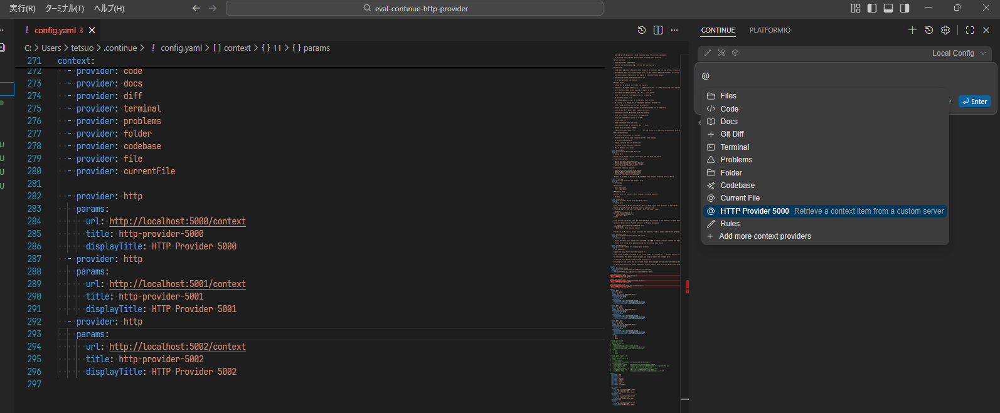
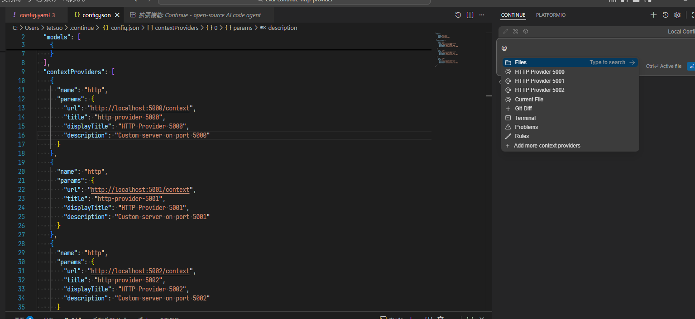

# Bug: Multiple HTTP context providers only load first one in config.yaml (works correctly in config.json)

## Environment

- **OS**: Windows 11 (25H2, 26200.7462)
- **Continue version**: 1.2.11
- **IDE**: VS Code
- **IDE version**: 1.107.1

## Description

When defining multiple HTTP context providers in `config.yaml`, only the first provider appears in the `@` mention dropdown. However, the same configuration works correctly in `config.json`, where all providers are displayed.

This appears to be a YAML parser or config loading issue specific to handling duplicate `provider: http` entries.

## Steps to Reproduce

1. Create `~/.continue/config.yaml` with multiple HTTP context providers:
  ```yaml
  context:
    - provider: http
      params:
        url: http://localhost:5000/context
        title: http-provider-5000
        displayTitle: HTTP Provider 5000
        description: Retrieve a context item from custom server 5000
        
    - provider: http
      params:
        url: http://localhost:5001/context
        title: http-provider-5001
        displayTitle: HTTP Provider 5001
        description: Retrieve a context item from custom server 5001
        
    - provider: http
      params:
        url: http://localhost:5002/context
        title: http-provider-5002
        displayTitle: HTTP Provider 5002
        description: Retrieve a context item from custom server 5002
  ```
2. Reload VS Code
3. Open Continue chat panel
4. Type `@` to open context provider dropdown

## Expected Behavior

All three HTTP providers should appear in the dropdown:

- HTTP Provider 5000
- HTTP Provider 5001
- HTTP Provider 5002

## Actual Behavior

Only "HTTP Provider 5000" appears in the dropdown.

## Workaround - config.json works correctly

When using the equivalent configuration in `config.json`, all three providers display correctly:

```json
{
  "contextProviders": [
    {
      "name": "http",
      "params": {
        "url": "http://localhost:5000/context",
        "title": "http-provider-5000",
        "displayTitle": "HTTP Provider 5000",
        "description": "Custom server on port 5000"
      }
    },
    {
      "name": "http",
      "params": {
        "url": "http://localhost:5001/context",
        "title": "http-provider-5001",
        "displayTitle": "HTTP Provider 5001",
        "description": "Custom server on port 5001"
      }
    },
    {
      "name": "http",
      "params": {
        "url": "http://localhost:5002/context",
        "title": "http-provider-5002",
        "displayTitle": "HTTP Provider 5002",
        "description": "Custom server on port 5002"
      }
    }
  ]
}
```

With this configuration, all three providers appear correctly in the dropdown.

## Screenshots

### config.yaml - Only first provider shown



### config.json - All providers shown correctly



## Analysis

The issue appears to be in the YAML-to-internal-config conversion logic. Possible causes:

1. **Deduplication logic**: The YAML parser or config loader may be deduplicating entries with the same `provider: http` key
2. **Instance creation**: Multiple instances of `HttpContextProvider` may not be created correctly from YAML config
3. **Parameter passing**: The `params.title` and `params.displayTitle` may not be properly passed to instantiate unique providers

The fact that `config.json` works correctly suggests the issue is specifically in the YAML config parsing/loading pipeline, not in the core context provider registration logic.

## Additional Context

- Other context providers (e.g., `@code`, `@docs`, `@file`) work correctly in both config formats
- The issue specifically affects multiple instances of the same provider type
- config.yaml takes precedence over config.json when both are present, preventing the use of config.json as a workaround. While reverting all settings to config.json (i.e., the deprecated legacy format) would work, this is not a prudent choice

## Suggested Fix

The config loader should:

1. Allow multiple entries with the same `provider:` value in YAML
2. Create separate instances for each entry with unique `params.title` values
3. Ensure YAML and JSON configs have feature parity

## Related Information

- config.ts has been deprecated, preventing workarounds via TypeScript configuration
- VSCode Extension API workaround is possible but requires users to create custom extensions
- This blocks users from using multiple HTTP endpoints in YAML-based configurations
